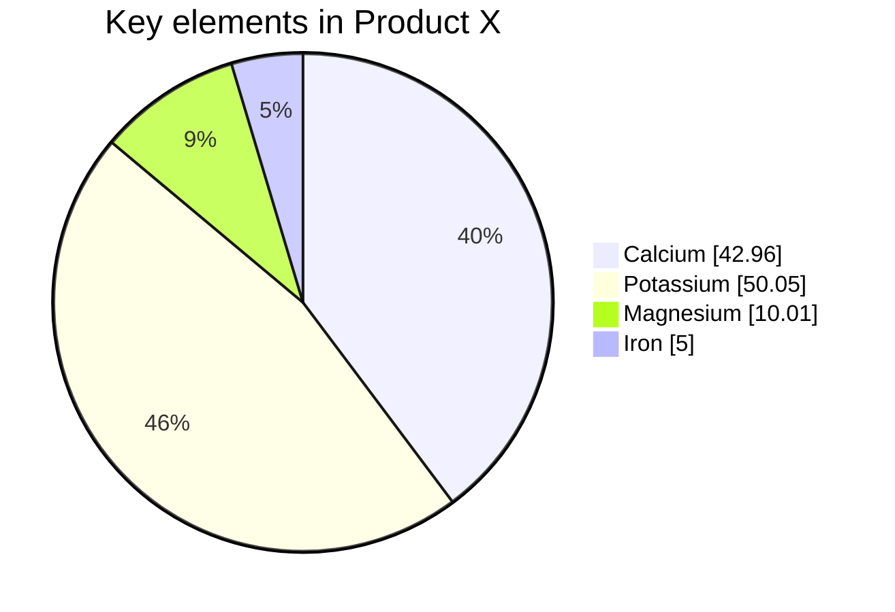
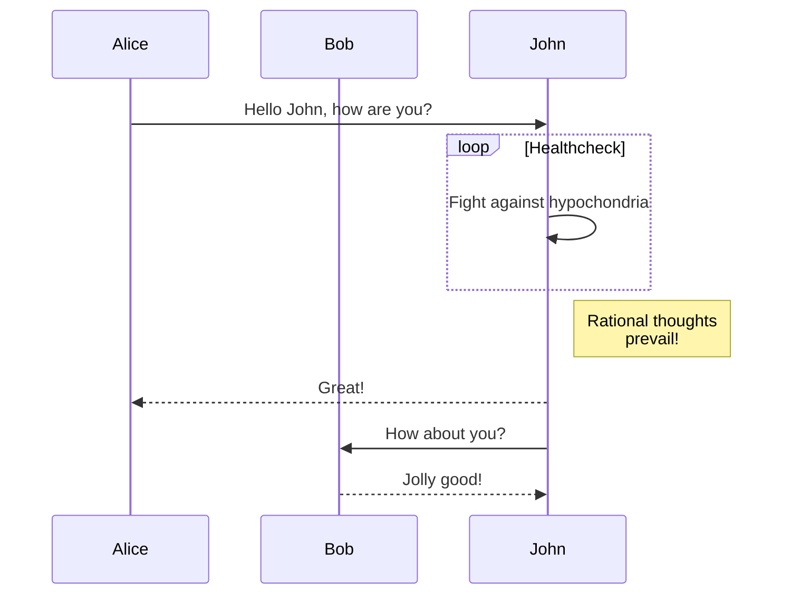

# docs-test

```mermaid
pie showData
    title Key elements in Product X
    "Calcium" : 42.96
    "Potassium" : 50.05
    "Magnesium" : 10.01
    "Iron" :  5
```

Here is a simple flow chart:

```mermaid
graph TD;
    A-->B;
    A-->C;
    B-->D;
    C-->D;
```

sequence diagram

```mermaid
sequenceDiagram;
    participant Alice
    participant Bob
    Alice->>John: Hello John, how are you?
    loop Healthcheck
        John->>John: Fight against hypochondria
    end
    Note right of John: Rational thoughts <br/>prevail!
    John-->>Alice: Great!
    John->>Bob: How about you?
    Bob-->>John: Jolly good!
```
